### Acerca de mi
- Soy Idelfonso Guardo
- Ingeniero Senior de soluciones cloud en Oracle
- Habilidades:
            Oracle Cloud Infraestructure (OCI)
          - Amazon Web Services (AWS)
          - Kubernetes
          - Docker
          - Cloud Native
          - IaC (Terraform)
          - Linux

 

<h1 align="center"> La solución de Oracle Logging Analytics para Kubernetes </h1>

<h4 align="justify"> La solución de supervisión de Kubernetes en Oracle Logging Analytics es ideal para supervisar y generar estadísticas sobre su cluster de Kubernetes desplegado en OCI, en cualquier otra nube pública, nubes privadas o en entornos locales, incluidos los despliegues de Kubernetes gestionados en OCI.
</h4>

<h4 align="justify">Los datos de telemetría, como métricas, estado de Kubernetes en forma de información de objeto y los distintos logs del entorno de Kubernetes, se recopilan para el análisis.
</h4>

<h4 align="justify"> Puede consultar el tipo de logs que se recopilan del entorno de kubernetes Engine (OKE) en el siguiente enlace: </h4>

[Página oficial Oracle Logging Analytics](https://docs.oracle.com/es-ww/iaas/logging-analytics/doc/kubernetes-solution.html)

<h4 align="justify"> Se asume que se tiene desplegado un cluster OKE con alguna aplicación en funcionamiento</h4>

 

## Pasos para utilizar la solución:

1. Abra el menú de navegación y haga clic en Observación y gestión. En Logging Analytics, haga clic en Soluciones y, a continuación, en Kubernetes. Se abrirá la página Solución de supervisión de Kubernetes.
2. En la página Solución de supervisión de Kubernetes, haga clic en Conectar clusters. Se abrirá el asistente Agregar datos. Aquí, la sección Supervisar Kubernetes ya está ampliada. Haga clic en Aceptar de Oracle. Se abrirá la página Configurar supervisión de entorno de OKE.
   
   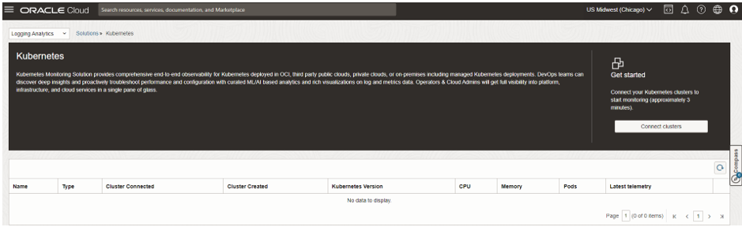
   
3. Seleccione el cluster de OKE con el que desea conectarse a Oracle Logging Analytics haciendo clic en la fila correspondiente de la tabla de clusters. Utilice los detalles de la tabla para identificar el cluster de OKE correcto. Haga clic en Siguiente.
   
   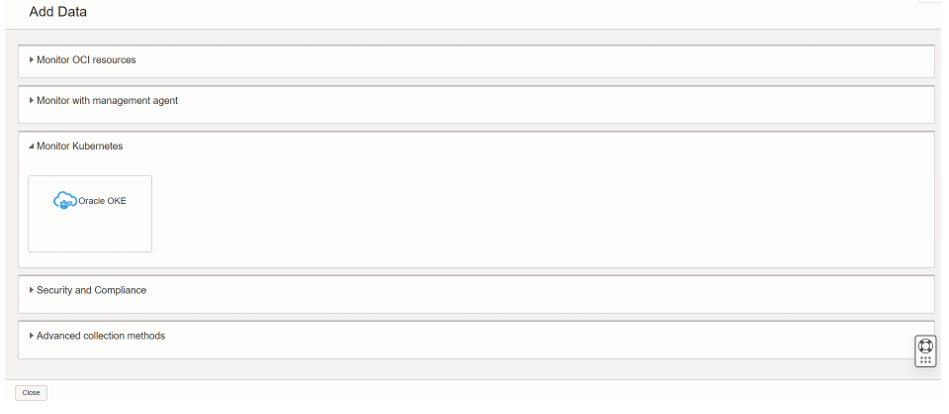
   
   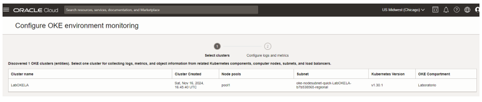
   
4. En el menú, seleccione el compartimento para almacenar los datos de telemetría y los recursos de supervisión relacionados.
   
   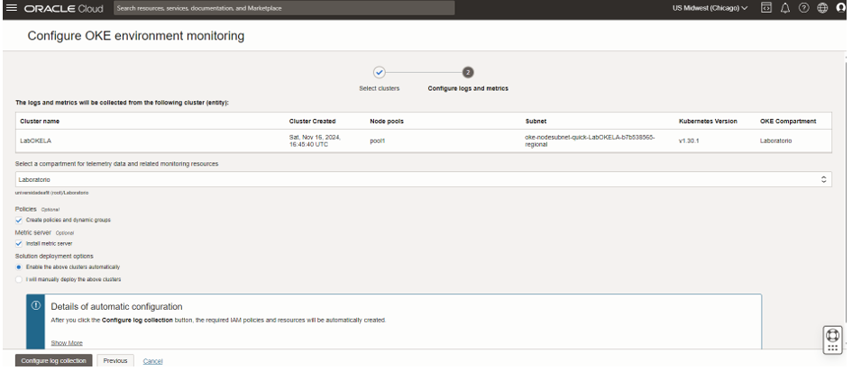
   
5. De manera opcional, el servidor de métricas se instala para la recopilación de métricas de uso. Puede desactivar la casilla de control si ya la ha instalado.
6. Seleccione la opción de despliegue de solución:
- **Activar los clusters anteriores automáticamente**: seleccione esta opción para permitir que Oracle Logging Analytics cree automáticamente todos los recursos necesarios.
La configuración de recopilación automática de logs crea o actualiza los siguientes recursos:

   - Política de IAM y grupos dinámicos
   - Grupos de logs y entidades de Oracle Logging Analytics
   - Clave de agente de gestión
   - Espacio de nombre de métrica
   - Configuración del agente de gestión
   - Configuración de Fluentd
   - Manifiestos de Kubernetes y gráfico de Helm
     
   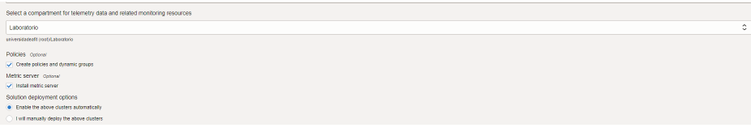

- **Desplegar manualmente los clusters anteriores**: seleccione esta opción para que Oracle Logging Analytics cree todos los recursos de Oracle Cloud Infrastructure y le proporcione la capacidad de gestionar el despliegue de Fluentd y otra configuración mediante manifiestos de Helm/Kubernetes en el cluster. Sin embargo, las instrucciones de instalación se proporcionarán al final del flujo de trabajo de conexión. Esta opción permite personalizar la configuración por defecto y otros parámetros de recopilación utilizados en el despliegue automático.

   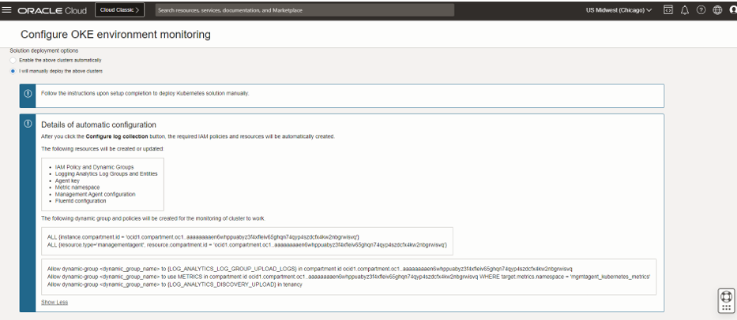
     

7. Haga clic en Configurar recopilación de logs para confirmar la configuración especificada.
Ahora se crean los recursos de Oracle Cloud Infrastructure.

   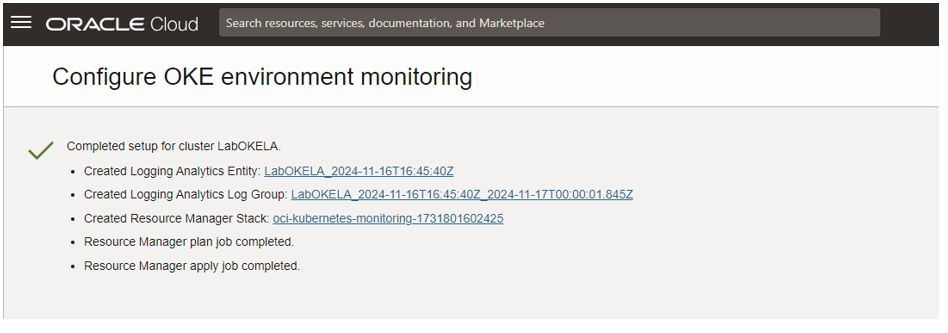

8. Si selecciona la opción de despliegue manual para la solución, siga las instrucciones de instalación proporcionadas al final del flujo de trabajo de conexión para el despliegue de gráficos de Helm. En esta demostración utilizaremos la opción **Activar los clusters anteriores automáticamente**

<h4 align="justify">Con esto, la configuración se ha completado para recopilar los datos del cluster de Kubernetes. Vaya a la página de la solución de supervisión de Kubernetes y espere unos minutos hasta que finalice la recopilación de datos. Cuando la recopilación de datos está en curso, la última telemetría del cluster es Unknown. Puede ver la solución después de que este estado cambie.
</h4>

  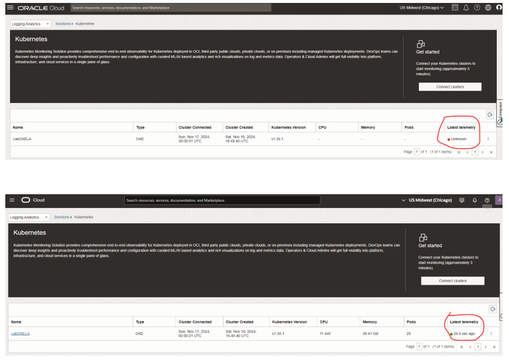

<h4 align="justify">Los datos de telemetría recopilados del cluster de Kubernetes se presentan en varias vistas para ayudarle a obtener información sobre el entorno y su rendimiento.
</h4>

 

## Para ver la solución para el cluster de Kubernetes:

1. Abra el menú de navegación y haga clic en Observación y gestión. En Logging Analytics, haga clic en Soluciones y, a continuación, en Kubernetes. Se abrirá la página Solución de supervisión de Kubernetes.
2. En la página Solución de supervisión de Kubernetes, haga clic en el nombre del cluster que desea supervisar y analizar. La solución para el cluster seleccionado se abre con la vista por defecto Cluster.

<h4 align="justify">Ahora, explore la solución y las distintas vistas disponibles para recorrer los niveles de la topología y obtener detalles en cada nivel en Vista de cluster, Vista de carga de trabajo, Vista de nodo y Vista de pod. Tenga en cuenta que el contexto de filtro se mantiene entre las diferentes vistas.
</h4>

Vista del Cluster

   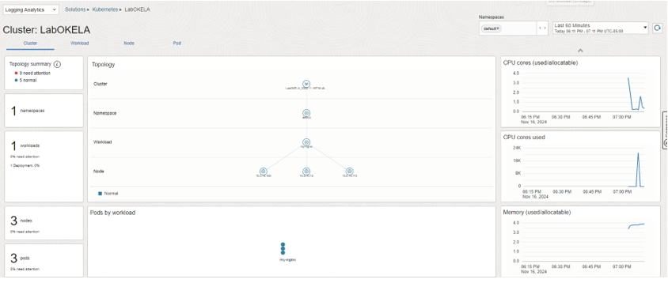

Vista de Carga de trabajo

  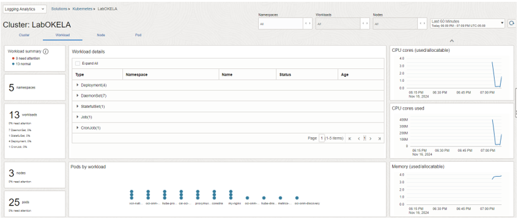

Vista de nodos

 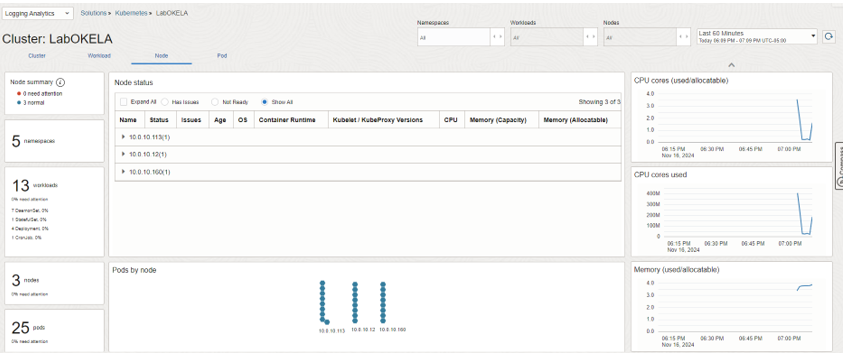

 Vista de pods

 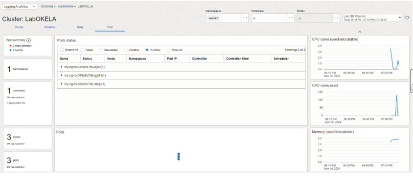

 Vista Dashboards Oracle Kubernetes Engine(OKE)

 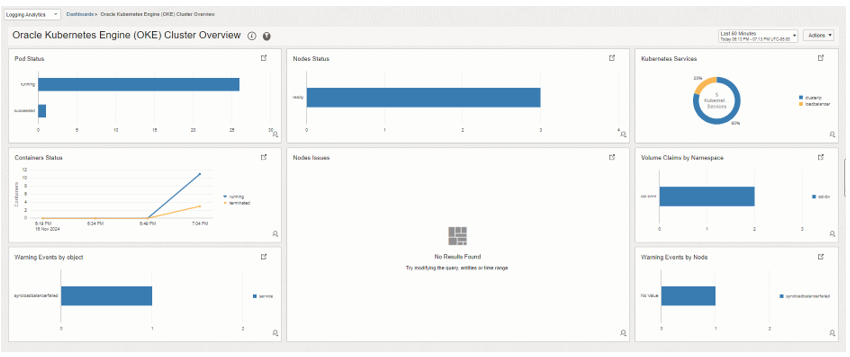
 

